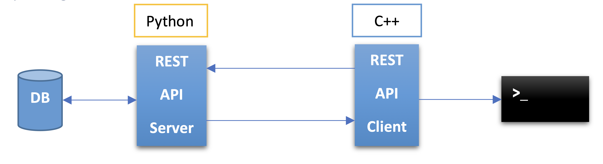

# RESTful Infrastructure

## A. Programming Task – REST API - Server and Client

### Task Concept
Develop a (very) small “RESTful infrastructure” by setting up a database (DB), implementing a REST API server as well as a REST API client. The client shall be able to store data through the API as well as retrieve this data. There is no specification of how this data should look like. You are also free in the choice of frameworks and database management systems.

### Boundary Conditions
1. The REST API server shall be written in Python.
2. The REST API client shall be written in C++.
3. The client shall save data persistently within the database through the REST API.
4. The client shall read data from the database through the REST API.
5. The client shall print information about this data exchange to the console.
6. Use a build system (for C++); e.g., make, cmake, ninja, etc.
7. You are free in the choice of frameworks, DBMS, operating system, deployment.

### Concept Image

### Task Implementation Specification
Implement a REST infrastructure consisting of:
- **Database**
- **REST API Server** (written in Python)
- **REST API Client** (written in C++)
- **Working example with meaningful output to the console**

Implement at least 3 API endpoints that:
- Store data (coming from the client)
- Read data (coming from the database)
- Update data that is already present in the database

## Setup Commands Summary

- **`pip install uv`**: Installs the `uv` tool for managing and running Python projects.

- **`pip install --upgrade pip`**: Upgrades the `pip` package manager to the latest version.

- **`pip install --upgrade uv`**: Upgrades the `uv` tool to the latest version.

- **`uv add --group dev ruff`**: Adds `ruff`, a linter, to the development group for code quality checks.

- **`uv add --group test pytest`**: Adds `pytest`, a testing framework, to the test group for writing and running tests.

- **`uv add sqlalchemy fastapi`**: Adds multiple dependencies for the project to `pyproject.toml`.

- **`uv sync`**: Synchronizes the project dependencies as defined in the configuration.
